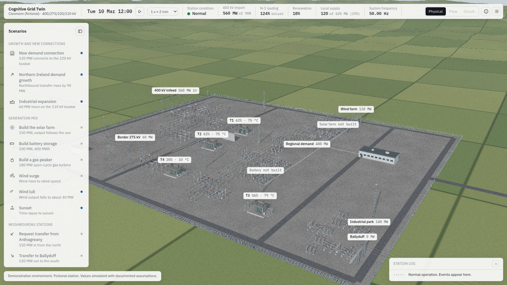
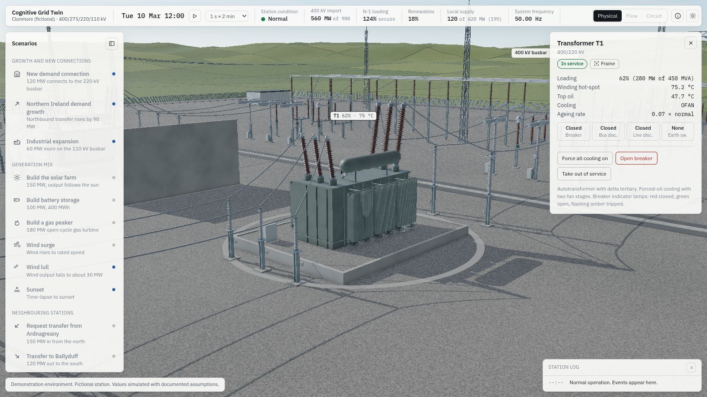
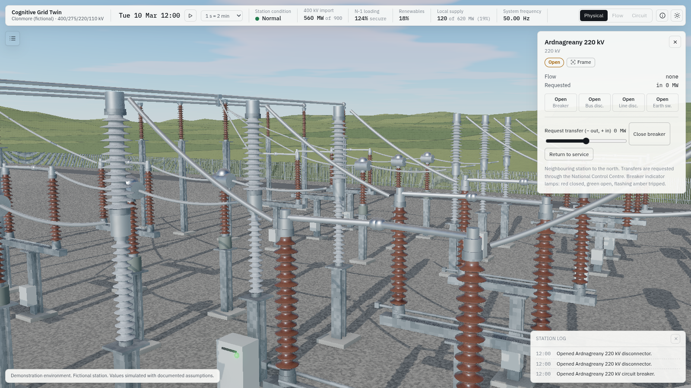
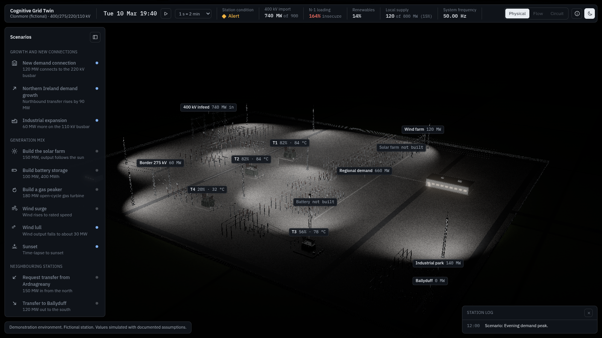

# Milestone 3: station in 3D

Status: first complete pass. 2 October 2026.

The deployed page (`/station-twin`) now opens the 3D station rather than the debug tables. The console is still available at `?console`.

| | |
|---|---|
|  |  |
|  |  |

## What works

- **The station, procedurally modelled, three phases everywhere.**
  - **Generation:** the layout is generated from a declarative bay list (`src/scene/layout.ts`): 22 bays, 4 busbars including the sectionalised 220 kV busbar, and its bus-section bay.
  - **Busbars and droppers:** tubular busbars on post insulators, with droppers from each busbar phase.
  - **Switchgear:** live-tank SF6 breakers (a twin-chamber T-head at 400 and 275 kV, a single vertical chamber at 220 and 110 kV) and centre-break disconnectors.
  - **Measurement and protection:** earth switches on line bays; current transformers; capacitive voltage transformers, with line traps on the outer phases; surge arresters, with grading rings at 275 kV and above.
  - **Terminations:** cable sealing ends; and line gantries with strain insulator strings.
- **Transformers (T1 to T4).** Each has:
  - a tank with stiffeners;
  - radiator banks with two fan stages, plus oil pumps on the OFAF units;
  - a conservator and Buchholz pipework;
  - HV, LV and neutral bushings, tilted;
  - a tap-changer compartment and a marshalling kiosk;
  - a bunded plinth with gravel sump.

  A fire wall separates T1 and T2.
- **Site.**
  - **Ground:** a gravel yard with stone detail at close range, asphalt ring and cross roads, and covered cable trenches.
  - **Boundary:** a palisade fence (instanced pales) with the gate.
  - **Structures:** ten lattice lighting masts, the control building with lit windows at dusk, and a relay room.
  - **Beyond the fence:** rolling drumlin terrain with a field patchwork.
- **Moving parts driven by the simulation.**
  - Disconnector blades rotate open and closed over about 3 s, and earth switches swing.
  - Breaker indicator lamps follow the breaker: red closed, green open, flashing amber tripped.
  - Transformer fans spin by cooling stage.
- **Light and time.**
  - **Sky and sun:** a physical sky with clouds. The sun is placed by solar geometry for 54° N on 10 March, driven by the simulation clock.
  - **Environment light:** re-baked from the sky as the sun moves.
  - **Shadows:** they follow the camera's focus and are sized to the viewing distance, so close-ups get centimetre-scale shadows.
  - **Night:** at dusk the photocell switches on mast floodlights and the building lights.
- **Post-processing.** GTAO ambient occlusion (normals reconstructed from depth), selective bloom on emissive surfaces only, SMAA, and AgX tone mapping.
- **Two themes.**
  - Daylight and Control Room. Control Room sets the dark UI and a low-key grade, and never changes the time.
  - Both themes are finished in the UI.
- **The interface (Preact, about 25 KB of UI code).**
  - **Top strip:** clock, compression, pause, station condition, 400 kV import against its limit, N-1 loading, renewables, local supply, frequency (two values after a split), lens switcher (Physical; Flow and Circuit marked for milestones 4 and 5), Method, theme, and the EY logo slot.
  - **Scenario dock:** grouped, with line icons and severity markers.
  - **Inspector card:** live state per component type, a sparkline, switchgear device states, set-point sliders, and switching. Every switching action goes through a confirmation that names it, interlocks are enforced by the simulation, and refusals explain themselves.
  - **Labels:** projected from 3D, decluttered and hidden under panels.
  - **Feedback:** a toast with before-and-after delta chips, a station log, the permanent badge, and the Method and assumptions panel generated from config.
  - **Diagnostics and keys:** a debug readout (D); keys Space, S, T, H, M, D, F, R and Esc.
- **Interaction.**
  - Click any asset or label to select it and fly to a framed view of it.
  - A selection ring and a leader line tie the inspector card to its asset.
- **Build and verification.**
  - The build is still one self-contained HTML file: 1.5 MB, 585 KB gzipped.
  - `npm run e2e` opens both the console and the 3D app from `file://` and asserts no network requests and no errors.
  - All 99 simulation tests pass.

## What is approximate or not yet done

- **No WebGPU or frame-rate figures from this container.** There is no GPU here. WebGL2 renders through SwiftShader on the CPU, so a frame takes 0.3 to 1.5 s. WebGPU through SwiftShader did not complete a frame within 25 minutes for this scene. The app uses WebGPU automatically wherever the browser offers it. I still need your bench run on an M1 or M2 machine.
- **TRAA is off by default.** Under software rendering it produced uniform single-colour frames. SMAA is used on every tier, and TRAA can be tried with `?aa=traa` on a real GPU. If it works there, it should become the high-tier default, because it handles thin lattice members better than SMAA.
- **Lines end in mid-air.** Overhead lines leave the gantries and stop about 70 m out. Pylons, the network and the connected plant come in milestone 4.
- **No vegetation yet.** Fields are a procedural patchwork with painted hedgerow lines. Real hedgerows and trees come in milestone 4.
- **Triangle budget.** About 4 M triangles in a yard view with shadows. There is no level-of-detail system yet; insulator shed counts are the obvious place to save at a distance.
- **Bench route.** The `?bench=1` route from the plan is not built yet. The D overlay shows frame rate, frame time, draw calls and triangles in the meantime.

## What I would do next

1. **Milestone 4:**
   - pylons and lines to Ardnagreany, Ballyduff and the border, with catenary sag;
   - the wind farm, solar farm, battery, gas peaker, industrial park and town;
   - hedgerows and trees;
   - the Flow lens.
2. Try TRAA on a GPU, and add level of detail for insulators and fences.
3. Build the `?bench=1` route so you can send me numbers from a MacBook.
