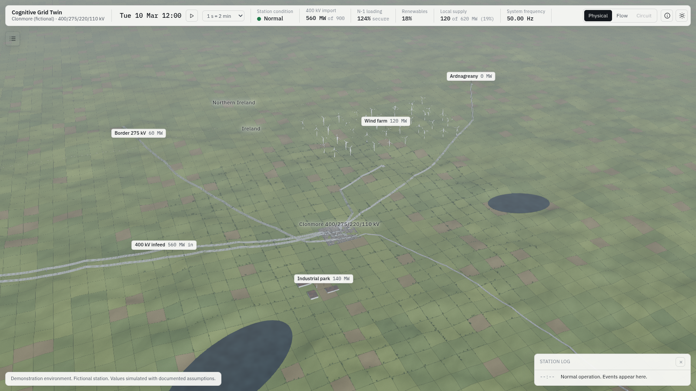
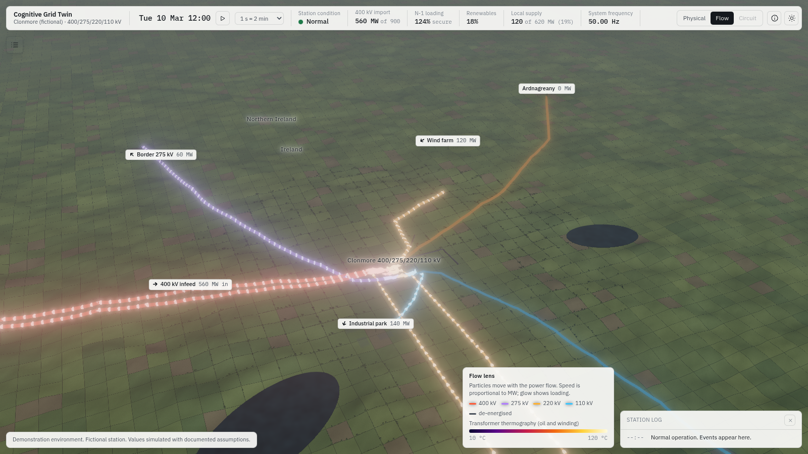
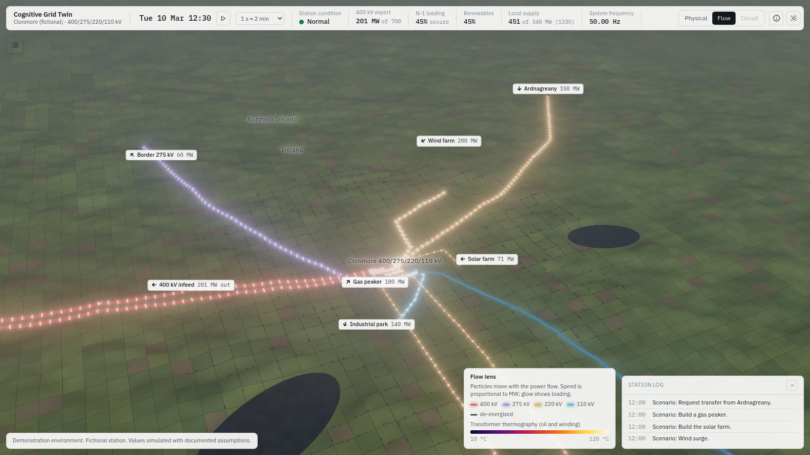
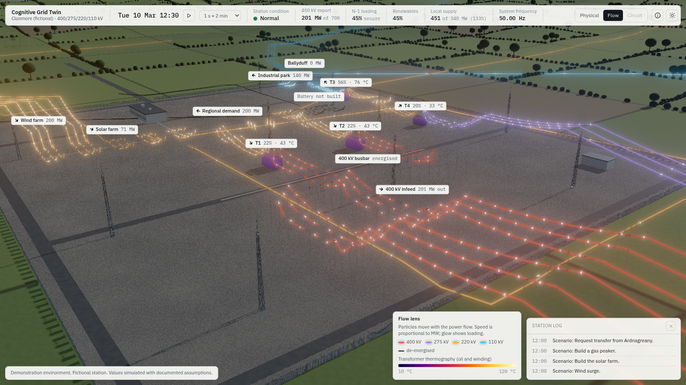
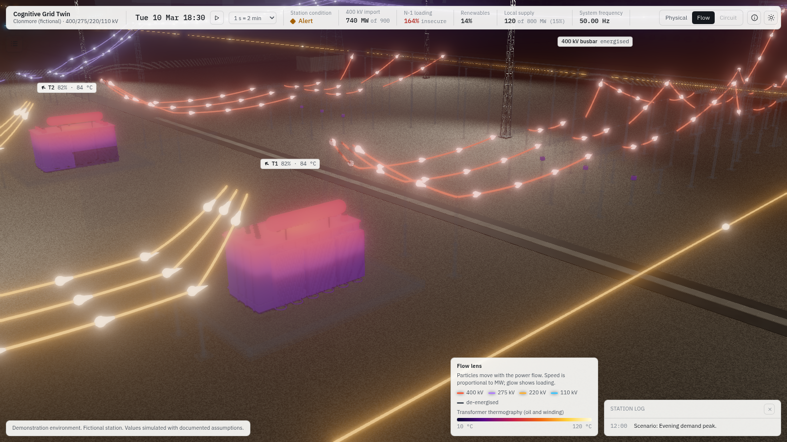
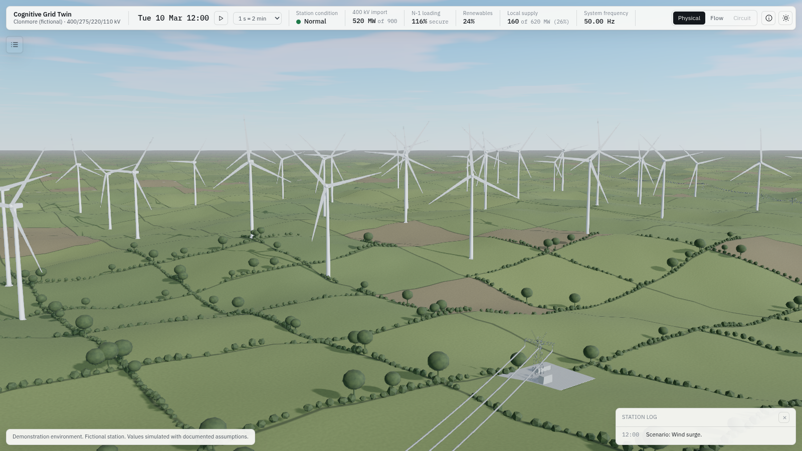

# Milestone 4: the surroundings and the Flow lens

Status: complete. 2 October 2026.

| | |
|---|---|
|  |  |
|  |  |
|  |  |

## What works

- **The network in place.**
  - Overhead lines leave every line bay on towers to their far ends: two 400 kV circuits west to the transmission system, the 275 kV border circuit north to Northern Ireland, 220 kV to Ardnagreany and to the wind farm, and a 110 kV wood-pole line south to Ballyduff. Towers are spaced along each route at a nominal span and turned to bisect the angle at each change of direction. Conductors sag between attachment points, and phases keep their side from tower to tower.
  - Buried cables run from each cable bay to the plant it serves (solar, gas, battery, new connection, industrial park and both regional demand feeders), with marker posts on the ground. They carry flow in the Flow lens.
  - Geography is compressed for composition and labelled with the real distance (a Simplification: the model has no line impedance, so no number changes).
- **Connected plant, all driven by the state.**
  - **Wind farm:** 40 turbines; rotor speed follows the simulated wind speed up to rated, and the rotors stop when the farm cuts out. A collector substation sits at the end of the line.
  - **Solar farm:** appears row by row over six seconds when the scenario builds it.
  - **Battery:** containers appear in sequence when built; status lights show state of charge (green, amber, red) and pulse while it is charging or discharging.
  - **Gas peaker:** appears when built; the plume runs only while the unit generates, and scales with output.
  - **New demand connection:** the campus appears when built, and its windows light at dusk only while it is supplied.
  - **Industrial park and town:** windows light at dusk; the town's lights follow the regional demand actually supplied, so load shedding shows as dark streets.
- **Landscape.** Drumlin terrain eases to a level plain under the haze. There are two loughs and an irregular field patchwork with some tilled fields. Hedgerows and trees follow the field boundaries, keeping clear of the plant sites and the water. The border is a dashed line, with "Ireland" and "Northern Ireland" labels that appear only at network zoom.
- **Zoom bands.**
  - Beyond about 1.1 km the labels move from the bays in the yard to the plant they name, and place labels for the station and the 400 kV system appear.
  - Bus labels are hidden at that range, as are transformer labels and anything not yet built.
  - Overhead conductors thicken slightly with distance so a line stays visible at network scale. The camera can pull back to 9 km. Shadows, fog and the near plane follow the viewing distance.
- **The Flow lens (key 2, or the Flow tab).**
  - **Glass and glow:** structures turn to glass and the scene dims. Every conductor glows in its voltage colour (400 kV red, 275 kV violet, 220 kV amber, 110 kV blue), brighter with loading. De-energised conductors go dark grey.
  - **Particles:** they move along every conductor, busbar dropper, transformer connection, line span and cable. Their direction comes from the solver's signs and their speed is proportional to MW. Particles flow continuously across joins between conductors, and each has a head and a tail, so direction reads in a still image too.
  - **Labels:** each label carries an arrow turned to the on-screen direction of flow.
  - **Thermography:** the transformer tanks show it from the thermal model. It runs from bottom oil at the base to top oil at the top, with the winding hot spot near the top centre. The scale runs from 10 to 120 °C.
  - **Legend:** a legend explains the lens.

## Acceptance

- **Particles match the solver for every conductor.** `tests/unit/flow.test.ts` (27 tests) checks four things:
  1. Outward flows at every busbar sum to zero, using the lens's own sign mapping, at 12 points in each of the 20 scenarios. This only holds if every sign agrees with the solver.
  2. Every flow path in the scene runs outward from its busbar, along the line or cable.
  3. In the Flow layer itself, every key's particles advance by exactly the solver's signed MW times the speed constant.
  4. A sampled 400 kV particle moves towards the station on import and away from it on export.
- **Export reverses the 400 kV conductors.** The test and screenshot 03 cover it: wind surge, solar, the gas peaker at 180 MW, a 150 MW transfer from Ardnagreany, and regional demand at 200 MW together give 201 MW export. The 400 kV label arrows and particles point away from the station.
- **Network-zoom screenshots.** All 14 captures are in `m4/`, made with `tools/shoot-m4.sh` in the deterministic capture mode.
- **Other checks.** 126 tests pass. Typecheck is clean, the file:// check passes, and the build is a single 1.6 MB HTML file.

## What is approximate

- **Thermography:** a visual of the model's three temperatures (bottom oil, top oil, hot spot), not a thermal field solution.
- **Speed scale:** particle speed scales with viewing distance so the motion stays visible at network zoom. It is still proportional to MW at any one zoom level.
- **400 kV split:** the two 400 kV circuits share the infeed equally (the model has one GRID component).
- **Landscape:** the field grid is regular under its irregular colouring. A finer, non-grid field layout is a polish item.
- **Performance:** SwiftShader in this container reports 5 to 8 million triangles at network zoom, including shadows. Real-GPU numbers still need someone at EY to run the two-minute bench.

## Capture parameters added

`lens=flow`; `ops=gen:ID:MW`, `demand:ID:MW`, `battery:MW` and `advance:S` alongside `operate:...`.
