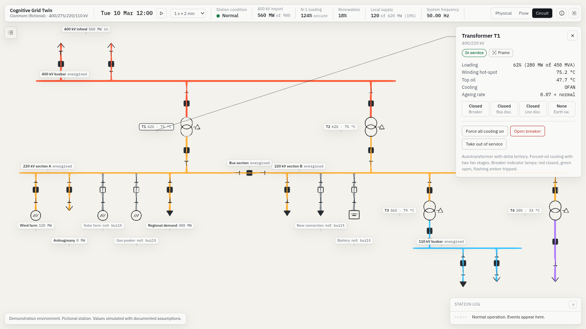
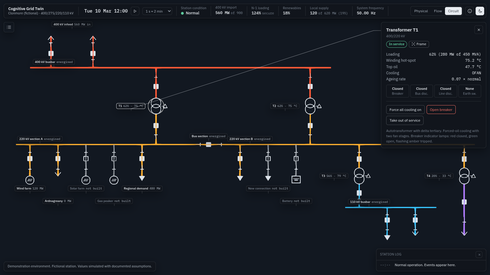
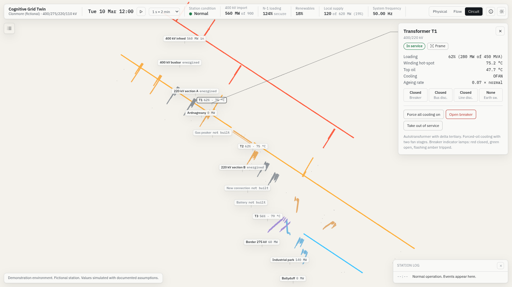
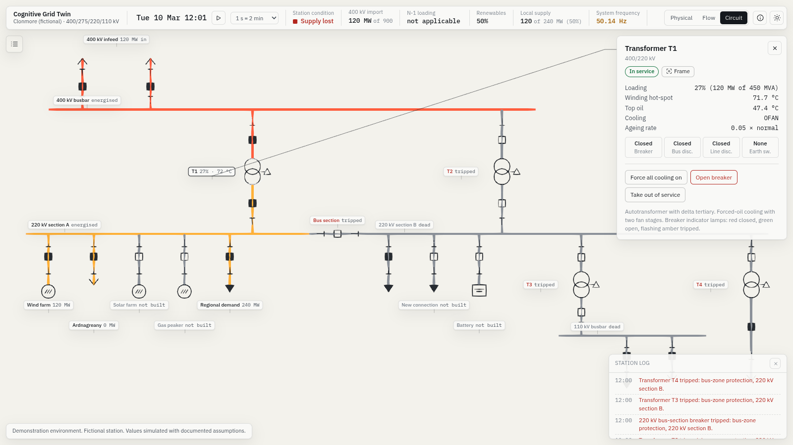

# Milestone 5: the Circuit lens and the fold

Status: complete. 2 October 2026.

| | |
|---|---|
|  |  |
|  |  |

## What works

- **The Circuit lens (key 3, or the Circuit tab).** The station folds into its single-line diagram in place, and folds back on key 1 or 2.
- **One parameter drives the fold.** It moves at a fixed rate towards its target, so pressing a lens key part-way through reverses from wherever the fold is. A full fold takes 2.2 s and runs in four stages:
  1. **Dissolve (0 to 0.6 s).** The yard, structures, fence, buildings and landscape dissolve with dithered alpha, which has no sorting artefacts, into a plain paper ground. The camera rises in an arc and its field of view narrows from 38° to 12°, near-orthographic, looking straight down.
  2. **Travel (0.4 to 1.5 s).** Every conductor interpolates from its 3D path to its schematic path in the vertex shader, staggered bay by bay. The three phases of each bay converge onto one line, because each phase's arc length maps to the same point on the feeder. Busbars straighten onto their rails.
  3. **Resolve (1.1 to 1.8 s).** IEC 60617 symbols fade in:
     - breakers as squares, filled when closed;
     - disconnectors as a broken line with a pivoting blade, open at an angle;
     - transformers as two overlapping circles, with a delta tertiary on the autotransformers;
     - generators as circles with a wave;
     - loads as arrowheads;
     - the battery as a cell symbol;
     - lines as open arrows.

     Conductors take their voltage colour when energised and go grey when dead.
  4. **Label (1.65 to 2.2 s).** Labels travel with their bays to the diagram positions and settle there, in alternating rows so neighbours never collide.
- **Live diagram.** Breakers, disconnectors and energisation follow the simulation state, so trips, the bus fault and new connections show in the diagram as they happen.
- **Interaction in the diagram.** Selection carries across the fold: the inspector stays open, the selection ring travels with its bay, and clicking a feeder, rail or transformer in the diagram selects it. In the Circuit lens the camera pans and zooms only.
- **Colour fidelity.** The diagram uses its exact colours: tone mapping is blended out once the paper is down, and the Control Room grade and ambient occlusion fade with the dissolve.
- **Layout.** The single-line layout is hand-authored in `src/scene/schematic.ts`: 22 feeders, 4 rails and 4 transformers, with feeders at least 40 m apart.

## Acceptance

- **Frame captures at ten points in each direction.** These are `m5/fold/forward-01` to `forward-10`, and `m5/fold/back-01` to `back-10`. Further captures show both themes, N-1, the bus fault, all plant built, and an interrupted fold (`circuit-interrupted.png`: reversed at 45%).
- **Under 2.5 s.** `FOLD_SECONDS` is 2.2. `tests/unit/fold.test.ts` asserts completion under 2.5 s in each direction. It also asserts that reversal mid-fold continues from the same point, with no jump, and returns in proportion to how far the fold had gone.
- **Selection and values identical before, during and after.** `tests/e2e/fold.mjs` (now part of `npm run e2e`) loads the app with T1 selected and the clock paused. It reads the selected component, the full inspector text and every visible label value at six points: before, 30% and 70% forward, folded, 40% back, and after. It asserts they are identical. It passes.
- **Other tests.**
  - Fold tests also check that every bay and busbar has its place in the diagram, and that breaker and disconnector symbols follow the engine's switching state.
  - 133 unit tests pass. Typecheck is clean, and both e2e checks pass.

## What is approximate

- **Diagram text:** the diagram's text comes from the live labels (DOM), not glyphs in the scene. That keeps it crisp and accessible, but text does not scale with zoom.
- **Disconnector symbol:** it is simplified to a blade and a fixed contact, with no earth-switch symbol.
- **Dissolve:** the dithered dissolve reads as grain in a still frame. In motion it reads as a dissolve. TRAA, which would smooth it, is still opt-in until it is verified on a GPU.

## Also changed

Capture mode now advances every frame but draws only the last three, then waits for the GPU. This is faster and gives deterministic captures under software rendering. There are new capture parameters: `lens=circuit`, `then=LENS` and `thenFrames=N`.
