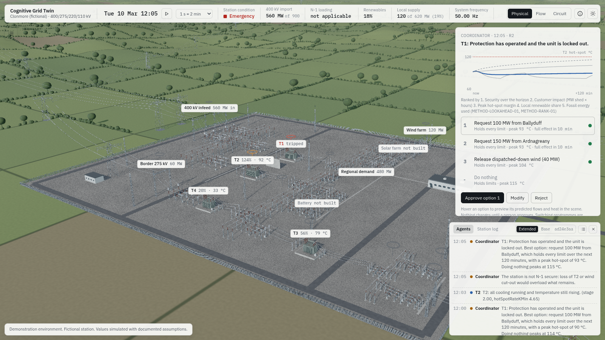
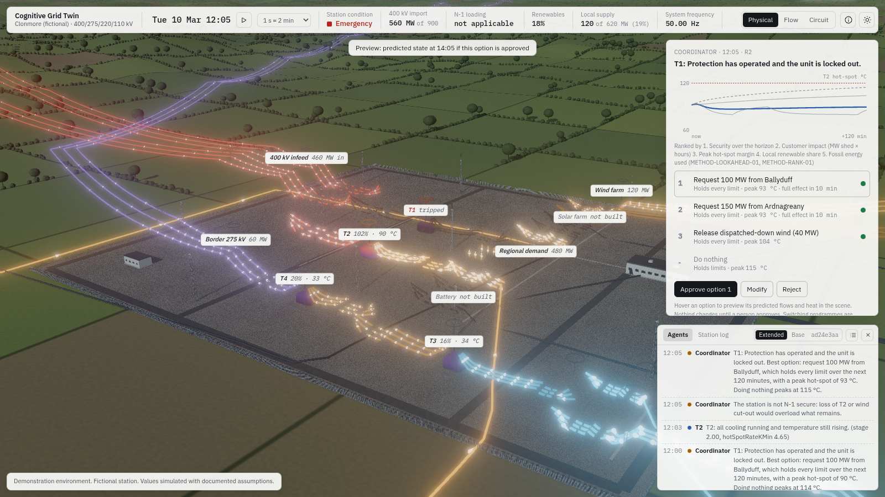
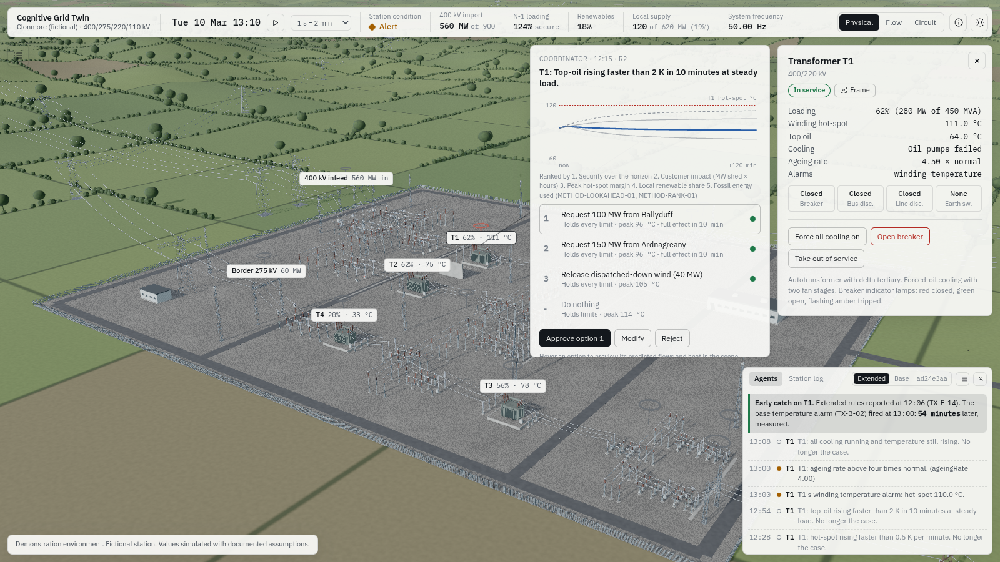
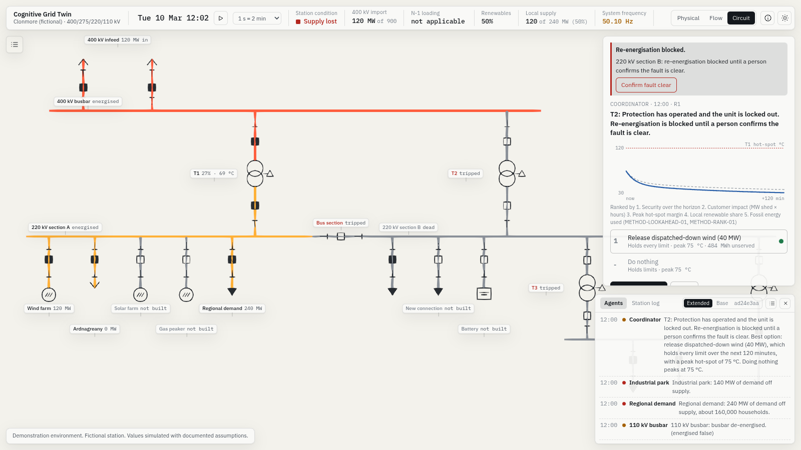

# Milestone 6: agents

Status: complete. 2 October 2026.

| | |
|---|---|
|  |  |
|  |  |

## What works

- **Twenty agents.**
  - Transformers T1 to T4.
  - Four busbars.
  - Wind, battery, gas, regional demand, the new connection and the industrial park.
  - The Ardnagreany, Ballyduff and border ties, and the 400 kV infeed.

  Each agent holds its own state and memory, and publishes a summary to its electrical neighbours with a timestamp. Each transformer agent runs its own IEC 60076-7 model of a healthy unit, driven by the measured load, ambient and fan stage. Its residual, measured top-oil minus its own expectation, is how it notices a cooling failure. The agents are in `src/agents/`.
- **Rules.**
  - Every rule is frozen and has an ID, a version, plain-English text and a sourced threshold, with its examples.
  - **Transformer rules:** 5 base and 30 extended, in exactly the groups of the plan: loading, hot-spot, rate of rise and model residual, cooling state, ambient, and N-1 headroom.
  - **Other assets:** 19 rules across busbars, wind, battery, gas, demand, ties and the infeed.
  - **Rule-set hash:** the version and hash are on screen in the feed header, and logged with every decision.
  - **Base mode:** extended rules are still evaluated silently, so the early catch can be measured.
- **Coordinator.**
  - **Contingency screen (METHOD-SCREEN-01):** every 5 simulated minutes. It covers the loss of each 400/220 kV unit, T3 and each tie, and wind cut-out.
  - **Forecast:** a 60-minute no-action forecast feeds the agents' projected inputs.
  - **When it plans:** on any warning or critical report, or when the screen is insecure. It re-plans when a new agent reports or an agent's worst severity rises, not for every extra rule.
  - **Actions it can propose:** force cooling, battery discharge or charge, start gas, transfer requests, wind release or dispatch-down, demand shedding, and rebalancing.
  - **Look-ahead (METHOD-LOOKAHEAD-01):** each candidate runs on an exact copy of the engine with the known schedule: 2 hours ahead for thermal problems, 30 minutes for balance. Faults are not foreseen, because scheduled trips are removed from the copy.
  - **Pairs (METHOD-COMBO-01):** if no single action holds, it tries pairs of the best single actions.
  - **Ranking (METHOD-RANK-01):** options are ranked in this order:
    1. security, including N-1 security once actions take effect;
    2. customer impact;
    3. peak hot-spot margin;
    4. renewable share;
    5. fossil energy.

    The order is printed on the card. Only options that beat doing nothing are offered.
- **Recommendation card.**
  - **The trigger:** what raised the recommendation, shown at the top.
  - **The fan of futures:** the predicted hot-spot of the unit most at risk under each option, against 120 °C and 140 °C, with doing nothing dashed.
  - **The ranked options:** each shows its security class, peak and unserved energy, and when it takes full effect.
  - **Decisions:** Approve, Modify and Reject. Modify edits the magnitude, for example the battery MW, and re-runs the look-ahead before any decision.
  - **Ghost preview:** hovering an option shows its predicted end state in the scene as a Flow-lens view of that future, with predicted label values.
- **Tracking (METHOD-TRACK-01).** On approval the prediction is re-run at that moment and the commands go through the engine, so they are in the input log. Actual is then compared with predicted every simulated minute. If a new event intervenes, the card says the prediction no longer holds and the coordinator re-plans.
- **Feed and trace.**
  - Entries are emitted on transitions only.
  - Each entry expands to its full trace: rule ID and version, rule text, input values, threshold with its source, outcome and method IDs. Clicking an entry flies the camera to the asset.
  - Narration is templated from the trace and labelled as narration. It never feeds a decision.
- **The early catch.** The engine measures it. Extended rules report the pump failure on T1 at 12:06 (TX-E-14, then the model residual TX-E-16 at 12:15). The base temperature alarm TX-B-02 fires at 13:00, so the extended rules are 54 minutes earlier, measured. Before the base alarm fires, the gap is projected by look-ahead and labelled as projected.
- **Blocked re-energisation.** After the 220 kV bus fault, section B stays blocked until a person confirms the fault is clear. That confirmation is a recorded decision.
- **Audit.** Each entry records:
  - simulated and wall time;
  - the operator label (editable) and the decision;
  - the recommendation and option;
  - the commands;
  - the rule-set hash and mode;
  - the input hash and the seed.

  The audit log is viewable in the app and exportable as JSON.
- **Markers in the scene.** A small ring and stem sit above each asset, calm grey by default. They take the colour of the agent's worst report, brighten while its evaluation is changing, and pulse when critical. A thin arc is drawn to a neighbour only when a published change coincided with that neighbour's evaluation changing.

## Acceptance

- **One generated test per rule.** `tests/agents/rules.test.ts` has 54 rule tests. Each checks that the rule fires on every firing example, stays quiet on every quiet example and on the nominal input, has its inputs defined, is frozen, and has a sourced threshold. Further tests cover unique IDs, the 5 and 30 counts, and the hash.
- **With no new event, actual matches predicted exactly.** `tests/agents/coordinator.test.ts` approves the best option after the loss of T1 and runs the full two-hour horizon. The largest deviation is `0`, and tracking completes as on track. A second test shows that an intervening event voids the prediction.
- **The early catch is measured and asserted.** In the cooling-pump failure, the extended detection is at least 20 simulated minutes before TX-B-02, and measured, not projected. In base mode, the feed is silent on T1 until TX-B-02.
- **Audit export validated.** The export round-trips through JSON with every field, and the input log replays to the identical state hash after an approval.
- **Scenario behaviour.** Six tests cover:
  - the evening peak: the screen flags N-1 insecurity before any fault, with a holding option;
  - N-1: T2 reports its trend before limits;
  - the storm: WND-01 fires before cut-out;
  - the split: TIE-01 fires and the coordinator treats it as a balance problem;
  - the bus fault: the block holds until a person confirms;
  - growth scenarios: advisory headroom before and after.
- **Other checks.** 206 tests pass in total. Typecheck is clean, both e2e checks pass, and the build is 1.7 MB.

## What is approximate

- **Transfer options:** the coordinator's transfer requests use fixed amounts, 150 MW from Ardnagreany and 100 MW from Ballyduff, changeable with Modify.
- **Switching programmes:** they are not candidates. They are always human-executed, and the card says so.
- **System split:** the coordinator offers rebalancing. Battery charging and wind dispatch-down appear only when they beat doing nothing, which in the baseline split they do not.
- **Narration endpoint:** the optional endpoint is not implemented. Narration is templated only, the default in the plan.
