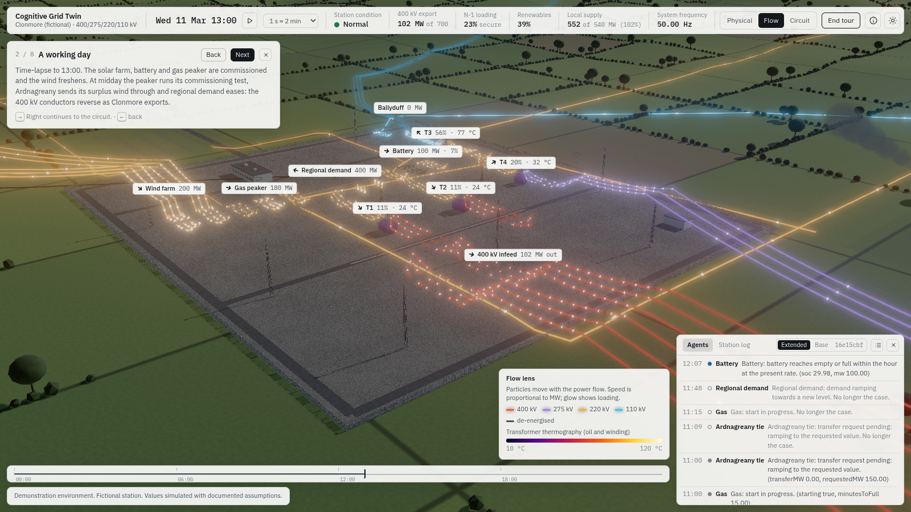
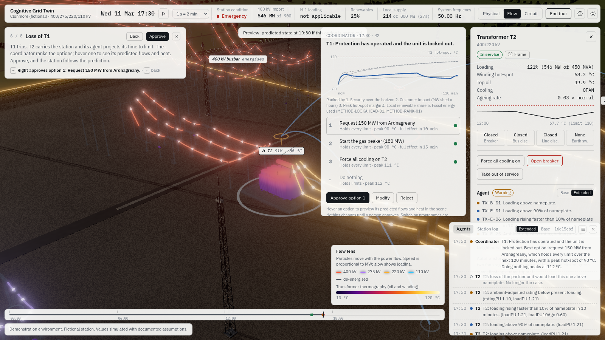
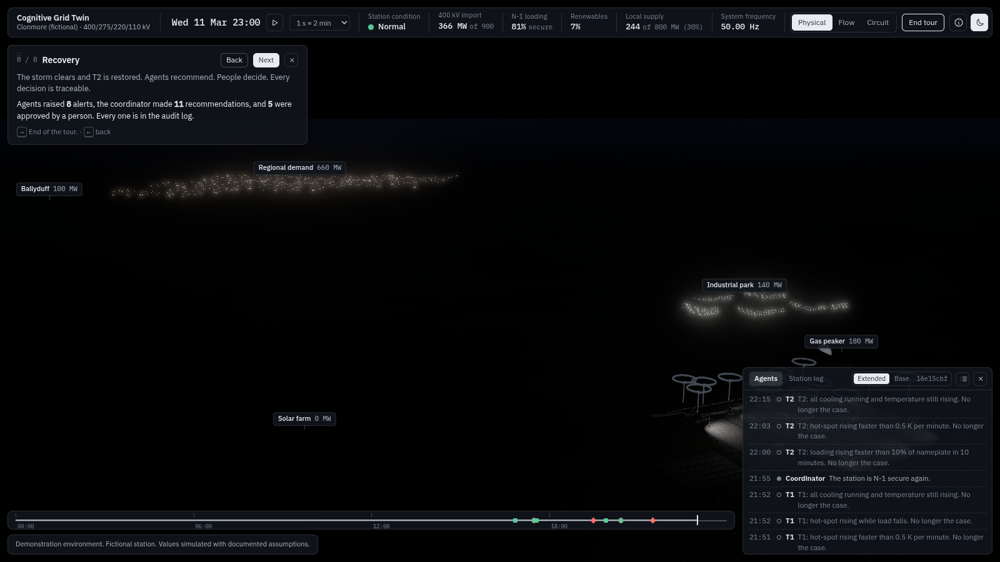
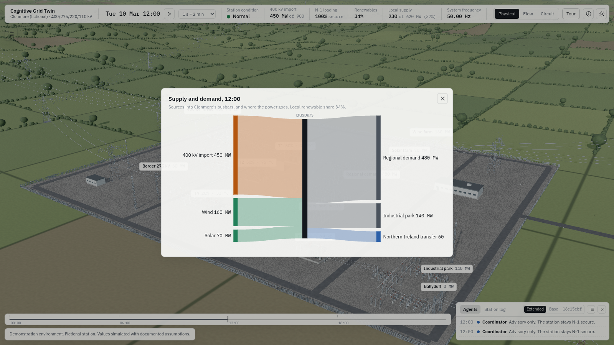

# Milestone 7: UI, presenter mode and the guided demo

Status: complete. 2 October 2026.

| | |
|---|---|
|  |  |
|  |  |

## What works

- **The guided tour.** Press Right, or click Tour in the top strip, to start. It has eight beats over one simulated day, Wednesday 11 March, following the plan's beat sheet. Every number on screen comes from the engine.

  | # | Beat | Simulated time | What happens |
  |---|---|---|---|
  | 1 | Arrival | 07:40, paused | The camera descends from the wind farm ridge along the lines into the yard |
  | 2 | A working day | 07:40 to 13:00, time-lapse (320×) | Solar, battery and gas are commissioned and the wind freshens. At midday the peaker's commissioning run, Ardnagreany's surplus wind and easing regional demand make Clonmore export about 100 MW. The 400 kV conductors reverse in the Flow lens |
  | 3 | The circuit | 13:00, paused | The fold, with T2 selected throughout |
  | 4 | Meet the agents | 13:00, paused | T2's inspector shows its agent, active rules and neighbours. The feed opens |
  | 5 | Evening peak | 13:00 to 17:30 | Demand ramps by 180 MW at 16:30. The contingency screen finds N-1 insecure before any fault, and the tour pauses on the recommendation |
  | 6 | Loss of T1 | 17:30 to 19:30 | T1 trips, T2's agent reports, and the ranked options and fan of futures appear. Hovering an option shows its ghost |
  | 7 | Storm | 19:30 to 21:30 | T1 returns through its interlocked switching programme. The storm brings a cut-out warning from the forecast, then the lightning flashover and the T2 trip |
  | 8 | Recovery | 21:30 to 23:00 | T2 is restored. The summary counts alerts, recommendations and approvals, and the closing line follows |

  - **Presenter controls.** Right advances. At a decision point the tour pauses on the recommendation, and the caption says "Right approves option 1: …" before anything happens. The approval is logged as the presenter's. Left goes back a beat.
  - **Deterministic beats.** Every beat is rebuilt by replaying the beats before it, so the same presses always give the same day. While the tour runs, the worker never takes its fast-path shortcut, so live play and a skipped beat give identical states.
- **Command palette (Ctrl or Cmd+K).** Jump to any asset, run any scenario, switch lens or theme, start the tour, or open the supply and demand diagram. Type to filter, use the arrows to move, Enter to run.
- **Supply and demand.** Click "Local supply" in the top strip. A Sankey shows sources into the busbars and on to the sinks, coloured by meaning, with the local renewable share. A stacked-bar fallback is used on narrow screens.
- **Timeline.** A bottom scrubber for the simulated day, with a cursor and event markers:
  - trips and alarms (red diamonds);
  - agent warnings (amber);
  - decisions (green).

  Clicking a marker flies to its asset. Clicking ahead fast-forwards. Clicking behind rewinds, which replays the input log exactly up to that time.
- **Inspector.** It now carries the asset's agent: its level, the rules reporting now, its neighbours, and the Base or Extended maturity toggle on transformers.
- **Presenter keys:**
  - Space: play or pause;
  - Right and Left: tour;
  - 1, 2 and 3: lenses;
  - S: scenarios;
  - A: agent feed;
  - R: reset;
  - F: fullscreen;
  - D: debug overlay;
  - T: theme;
  - M: method;
  - H: overview;
  - Ctrl or Cmd+K: palette;
  - Escape: close or clear.

  The key strip fades after ten seconds.
- **Both themes are finished.** The Control Room theme grades the scene and inverts every panel. Colour is always paired with a second cue: icon, text, shape or line style.

## Acceptance

- **The tour runs end to end under Playwright with a virtual clock, twice, with identical audit logs.** `tests/e2e/tour.mjs` opens the real app (worker and live clock) with a fixed virtual wall clock, and drives the whole tour with the Right key only. It does this twice and compares the two audit logs, which must be identical. It also asserts that the tour reached the last beat with the closing line, with no page errors. `tests/unit/tour.test.ts` checks the same in Node:
  - all eight beats in order;
  - identical audit logs and final state hash on two runs;
  - every beat reached by rebuilding equals the beat reached by pressing through;
  - the midday export happens.
- **Copy lint passes.** `tests/unit/copy.test.ts` scans every source, HTML and document file. It checks for no em dashes, no emoji, and British spellings in every interface string. It also checks the badge reads exactly "Demonstration environment. Fictional station. Values simulated with documented assumptions." and that no utility branding appears.
- **Other checks.** 214 unit tests pass and typecheck is clean. The original runtime copy lint, which runs scenario and log text through the same checks, now also covers rule text, agent narration and every caption and line of a full tour.

## What is approximate

- **Rebuilding beats:** reaching a late beat with Left replays the day from the start. That takes up to about seven seconds of computation in the worker. Caching beat snapshots would make it instant.
- **Midday export:** it needs the peaker's commissioning run and Ardnagreany's surplus. Both are stated in the caption rather than hidden.
- **Timeline rewind:** it replays commands, not decisions. Approved actions are commands, so the plant state is exact, but past recommendation cards are not restored.
