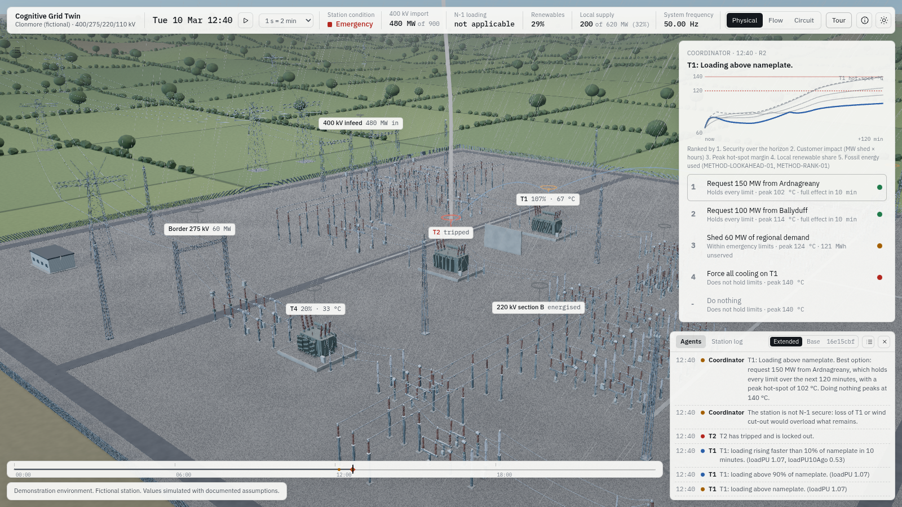
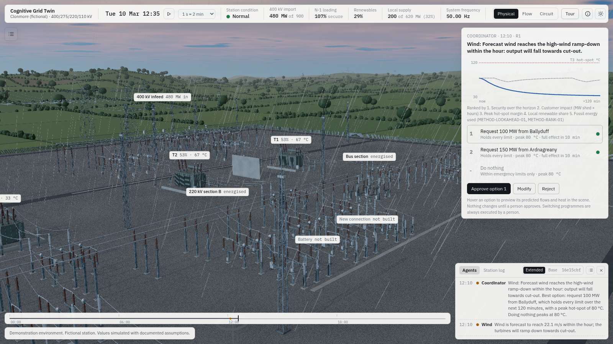

# Milestone 8: polish and verification

Status: complete. 3 October 2026. This is the last milestone of the plan.

| | |
|---|---|
|  |  |

## What was added

- **Storm effects, all driven by the state.**
  - **Rain:** falls while the weather says it rains, slanted by the simulated wind speed.
  - **Grade:** the storm lowers the exposure and thickens a greyer haze.
  - **Lightning:** when a lightning trip is logged, a forked bolt strikes the asset with a brief flash. The bolt's shape comes from the event time, so it is the same on every run. Sheet lightning flickers while the storm lasts.
  - **Replays:** old events never replay on load or after a jump in time.
- **Protection pulse.** A red ring expands from any asset whose protection operates.
- **Performance pass.**
  - **Adaptive resolution:** in live use, the pixel ratio steps down when frames run long and back up when there is headroom. Capture mode stays fixed.
  - **Shadows:** hedgerow shrubs no longer cast shadows, which saves about 0.3 million shadow triangles at network zoom.
- **Bench route (`?bench=1`).** A two-minute scripted route through the heaviest views:
  - the overview;
  - a yard close-up;
  - network zoom;
  - the Flow lens at network and yard scale;
  - the fold.

  It records average frame rate and 95th-percentile frame time per segment, and shows a summary to copy and paste back.
- **Tools.**
  - `tools/shoot-matrix.sh`: the screenshot matrix.
  - `tools/contact.mjs`: contact sheets.
  - `tools/jpeg.mjs`: JPEG re-encoding for the repository.

## Acceptance

- **Under 8 MB.** The whole application is a single HTML file of **1.67 MB**, with the simulation worker, fonts and everything else inline.
- **Offline test passes.** `tests/e2e/file-protocol.mjs` opens the build from `file://` with every network request blocked. The 3D app and the console run, and no request leaves the machine.
- **Screenshot matrix: 20 scenario states × 2 themes × 3 lenses = 120 images.** They are in `m8/matrix/`, with one contact sheet per state in `m8/sheets/`. All were captured with the WebGL2 backend, in the deterministic capture mode.
- **The twenty states.**
  1. baseline;
  2. new demand connection;
  3. Northern Ireland growth;
  4. industrial expansion;
  5. solar built;
  6. battery discharging;
  7. gas peaker running;
  8. wind surge;
  9. wind lull;
  10. sunset;
  11. import from Ardnagreany;
  12. export to Ballyduff;
  13. transfers ended;
  14. evening peak;
  15. system split;
  16. loss of T1;
  17. 220 kV bus fault;
  18. pump failure;
  19. storm;
  20. midday export.
- **What the review checked.** I reviewed every image. In every state, the condition, the flows, the diagram's switching state and energisation, and the agents' cards agree with each other and with the scenario.
- **Fixed during the review.**
  - A light band behind the palette and Sankey: a class-name clash with the Method panel.
  - Lightning that over-exposed the frame.
  - Rain too fine to see.
  - Old lightning replaying its flash when a later state was loaded.
  - Information-level rules crowding the agent feed, for example "ambient below 5 °C". They now show only on the asset's card.
- **WebGPU and WebGL2.** All captures here use WebGL2. Under software rendering in this container the WebGPU backend times out, so it cannot be measured here. The renderer selects WebGPU on capable hardware and falls back to WebGL2 automatically.

## Final verification

| Check | Result |
|---|---|
| Typecheck (TypeScript strict) | Clean |
| Unit, scenario, parity and agent tests (`npm test`) | 214 passed in 15 files |
| Offline, file:// (`tests/e2e/file-protocol.mjs`) | Passed |
| The fold keeps selection and values (`tests/e2e/fold.mjs`) | Passed |
| The guided tour twice with identical audit logs (`tests/e2e/tour.mjs`) | Passed |
| Copy lint, runtime and source | Passed |
| Build size | 1.67 MB, single file |

## Plan coverage

**Never cut, all delivered:**
- the fold;
- the look-ahead with ghost preview;
- the early catch, measured at 54 minutes;
- approval and audit;
- deterministic replay;
- both themes;
- close-up quality of the breaker and transformer;
- honest labelling;
- the guided tour.

**Cut, from the plan's own cut list:**
- heat shimmer above the peaker (the plume is kept);
- conductor sway;
- the optional language-model narration endpoint (narration is templated and offline, the plan's default).

The Sankey, the solar construction animation, rain and lough reflections, which were also on the cut list, are all in.

## Follow-up: full screen, smoothness and a build fix

- **Full screen button** at the right of the top strip, next to the theme toggle. F still works too. It uses the prefixed call on older Safari.
- **Solar and battery now appear when built live.**
  - **Cause:** their instanced meshes start folded to zero scale. three.js took their bounds on the first frame and then culled them for good.
  - **Why it was missed:** scenario captures build the plant before the first frame, so they never showed the fault.
  - **Fix:** the bounds are recomputed as the rows and containers rise. The gas plume had the same fault and is fixed too.
- **Smoothness, with the picture unchanged.** These target the "sometimes very laggy" reports on an M1 MacBook Pro.
  - **Shadows on demand.** The 4096 square shadow map was redrawn every frame. It is now redrawn at once when the camera's framing, the sun, the fold or the lens changes, and otherwise every third frame, which keeps rotor and fan shadows moving. In a comparison render, on-demand shadows matched every-frame shadows with no pixel differing by more than 24 levels.
  - **No velocity buffer unless TRAA is on.** SMAA, the default, never reads it, so writing it cost a full-resolution target for nothing.
  - **Frame pacing.** Frames are capped near 60 per second. On 120 Hz displays the browser offered twice as many, which doubled the GPU load and made the pacing uneven.
  - **Adaptive resolution without oscillation.**
    - A pixel ratio that proved too slow is not retried for 30 seconds, and the wait doubles on each repeat. Before, the stage could swing between two ratios every few seconds, reallocating every render target at each swing.
    - The first six seconds, while shaders compile, and isolated hitches no longer count as sustained load.
  - **Environment bakes.** The sky's environment map is baked into the same target each time, and at most every two seconds during time-lapse.
  - **Labels.** Labels move by transform rather than by position, so they need no layout pass. Panel rectangles are read four times a second, not every frame; before, reading them right after the labels moved forced a layout every frame.
  - **Fewer re-renders.** The worker sends the agent view (about 44 KB) only when it changes. The clock and tour signals are written only when they change, so panels no longer re-render 15 times a second for nothing.
  - **No garbage in per-frame loops.** Rain, markers, rotors, lamps and the battery lights reuse their scratch objects.
- **Checks.** Six comparison renders against the previous build (both themes, all three lenses, storm, high tier with a selection) differ only where the new button shifts the top strip.

## Follow-up 2: lighter GPU load, every build visible

Reports from an M1 MacBook Pro and an M4 MacBook Air: the app was still too slow. Measured CPU work per frame is 0.2 to 0.6 ms, so the load is on the GPU.

- **Low-detail insulators.**
  - **Why:** porcelain and composite insulators were 2.0 of the 4.2 million triangles in the overview, and the shadow map drew them a second time.
  - **What changed:** each insulator now carries a low-detail copy, with a third of the facets and three profile points per shed instead of five.
  - **When it is used:** beyond 110 m from the component, and always in the shadow map.
  - **Result:** triangles per frame fell from 7.4 to 4.1 million in the overview, from 4.5 to 3.4 million in a yard close-up, and from 4.9 to 3.3 million in the Flow lens. Close-ups are unchanged.
- **Pixel budget.** Retina screens were rendered at a pixel ratio of 2. Rendering now stops at about 1440p worth of pixels, which is a ratio of about 1.6 on a 13 or 14 inch MacBook and roughly 40% fewer pixels through every pass.
- **Ambient occlusion at half resolution.** The occlusion is soft, so the full-resolution pass cost more than it showed.
- **Flow lens legend.** It opens when the lens is chosen, then folds after six seconds to a small "Legend" button so it no longer covers the scene. It also has a close button.
- **Builds are seen.**
  - **Camera:** building the solar farm, battery, gas peaker or new demand connection now flies the camera to the new plant and selects it. Before, a new gas peaker, idle at 0 MW with no plume, could be built off screen and never noticed.
  - **Campus:** the data centre campus stood at ground level 0 on a slope that rises to 18 m, so it was partly buried. Each hall now stands on the highest ground under it, on a plinth.
- **New check: `tests/e2e/builds.mjs`.** It builds every buildable plant after the scene has started, photographs each site before and after, and requires a clear change. It fails on the earlier build (solar 0% changed) and passes now (gas 23%, battery 49%, solar 8%, campus 32%). It runs as part of `npm run e2e`.

## What still needs a person

- **Bench numbers on real hardware.** This container has no GPU. Someone at EY should open the build with `?bench=1` on an M1 or M2 MacBook at 1440p and paste back the summary. It takes two minutes.
- **The EY logo.** The slot in the top strip is empty until an SVG is provided (`src/config/branding.ts`).
- **IEC values.** Values marked "to confirm" in the Method panel are recalled typical values awaiting a check against IEC 60076-7.
